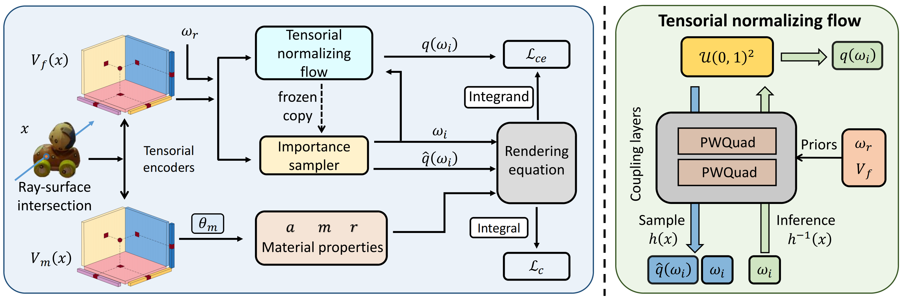

# TensoFlow: Tensorial Flow-based Sampler for Inverse Rendering
### [[Paper]](https://arxiv.org/abs/2503.18328) 

> [**TensoFlow: Tensorial Flow-based Sampler for Inverse Rendering**](https://arxiv.org/abs/2503.18328),            
> [Chun Gu](https://sulvxiangxin.github.io/), Xiaofei Wei, [Li Zhang](https://lzrobots.github.io), [Xiatian Zhu](https://surrey-uplab.github.io/)            
> **Shanghai Innovation Institute; School of Data Science, Fudan University; University of Surrey**  
> **CVPR 2025**

**Official implementation of "TensoFlow: Tensorial Flow-based Sampler for Inverse Rendering".** 

## 🛠️ Pipeline
<div align="center">
  
</div><br/>


## ⚙️ Installation
```bash
git clone https://github.com/fudan-zvg/tensoflow.git

conda create -n tensoflow python=3.10
conda activate tensoflow

pip install torch==2.5.1 torchvision==0.20.1 torchaudio==2.5.1 --index-url https://download.pytorch.org/whl/cu121
pip install -r requirements.txt
pip install git+https://github.com/ashawkey/raytracing.git
```

## 📦 Dataset
Please follow [TensoSDF](https://github.com/Riga2/TensoSDF) to download the TensoSDF dataset and the ORB dataset. Put them under the `nerf_data` folder. You may need to change the data path in the config files.

## TensoSDF synthetic dataset
```bash
SCENE=compressor
DEVICE=0
# geometry reconstruction
bash run_occ_syn_shape.sh $SCENE $DEVICE
# material estimation
bash run_occ_syn_material.sh $SCENE $DEVICE
```
## ORB dataset
```bash
SCENE=teapot
DEVICE=0
# geometry reconstruction
bash run_occ_orb_shape.sh $SCENE $DEVICE
# material estimation
bash run_occ_orb_mat.sh.sh $SCENE $DEVICE
# See an example of evaluating ORB dataset in eval_orb_relight.sh
```

## 🛠️ Visualization
<div align="center">
  
</div><br/>
<div align="center">
  
</div><br/>

## 📜 BibTeX
```bibtex
@inproceedings{gu2025tensoflow,
  title={TensoFlow: Tensorial Flow-based Sampler for Inverse Rendering},
  author={Gu, Chun and Wei, Xiaofei and Zhang, Li and Zhu, Xiatian},
  booktitle={CVPR},
  year={2025},
}
```
